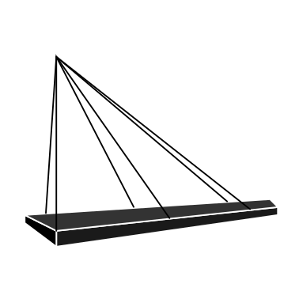

    
    <h1 align="center">NorthBridge</h1>

NorthBridge is the Minecraft Server proxy, which is similar to Bungeecord. It allow you to chain multiple NorthBridge servers.

## Requirement
- NodeJS and npm installed